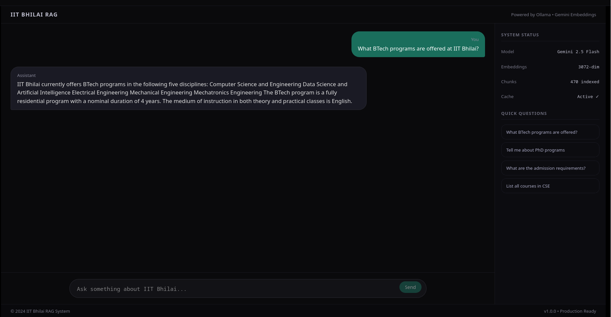

# IIT Bhilai Knowledge Retrieval System

A high-performance, 100% serverless Retrieval-Augmented Generation (RAG) pipeline designed for domain-specific information retrieval. Built with a client-side architecture, the system performs vector similarity search natively in the browser and delivers lightning-fast responses without requiring any backend infrastructure.



## Architecture & System Design

The system is decoupled into independent, scalable components:

- **Document Ingestion Pipeline (Offline)**: Automates the processing of unstructured documents using semantic chunking strategies (500-character chunks with 50-character overlap) and generates dense embeddings (3072 dimensions) via ChromaDB.
- **Client-Side Vector Search**: Leverages a static JSON export of the vector embeddings and performs native Cosine Similarity math directly in the user's browser.
- **Client-Side LLM Integration**: Securley connects to Google's Gemini API directly from the Next.js frontend to embed user queries and generate highly contextual RAG answers.
- **Client Interface**: React/Next.js frontend offering a responsive, real-time query interface that can be hosted on any static site provider (like Hugging Face Static Spaces) for free.

## Technical Stack

- **Data Pipeline**: Python 3.13, LangChain, Chroma DB
- **Embeddings & Inference**: Gemini Embedding 2 (text-embedding-004), Gemini 2.5 Flash
- **Frontend / Engine**: Next.js, React, TypeScript, Tailwind CSS

## Performance Characteristics

| Operation | Typical Latency | Description |
|-----------|----------------|-------------|
| Application Load | < 1 s | Static file delivery |
| Database Load | < 500 ms | Fetches 0.4MB JSON embeddings |
| Query Embedding | ~500 ms | Gemini API latency |
| Vector Search | < 50 ms | In-browser computation |
| Full RAG (Answer) | 2-4 s | Gemini generation latency |

## Local Development Setup

### Requirements
- Node.js 18+
- Valid LLM/Embedding API Keys

### Frontend Initialization

Create a `.env` file in the `frontend/` directory with:
```env
NEXT_PUBLIC_GOOGLE_API_KEY=your_api_key_here
```

Then run the development server:
```bash
cd frontend
npm install
npm run dev
```
*Client runs at `http://localhost:3000`*

## Hugging Face Deployment

This application is designed to be hosted 100% for free on Hugging Face Static Spaces.
1. Create a **Static Space**.
2. Add your `NEXT_PUBLIC_GOOGLE_API_KEY` to the Space Secrets.
3. Build the frontend via `npm run build` and upload the contents of the `out/` folder to the space.
