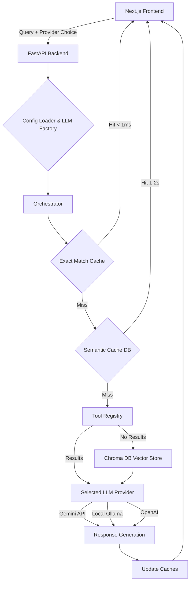

# IIT Bhilai RAG Architecture

This document outlines the architectural design of the IIT Bhilai Retrieval-Augmented Generation (RAG) system. The system implements a hub-and-spoke architecture with a flexible provider-switch path between local LLMs (Ollama) and cloud APIs (Gemini/OpenAI).

## High-Level Flow

1. **User Request**: The user submits a question via the Next.js frontend, specifying their preferred LLM provider (e.g., Gemini or Local Ollama).
2. **API Gateway**: The Next.js API route forwards the request to the FastAPI backend.
3. **Orchestrator & Caching**: The backend orchestrator first checks a two-layer cache (Exact Match -> Semantic Similarity) scoped to the specific provider and model.
4. **Retrieval**: If a cache miss occurs, the system queries registered tools, falling back to a direct vector search against the Chroma DB document store.
5. **Generation**: The retrieved context and the user query are sent to the selected LLM (via the LLM Factory) to generate an answer.
6. **Cache Update**: The generated response is saved in the cache for future identical or semantically similar queries.

---

## Core Components

### 1. Frontend (Next.js)
- **UI/UX**: Next.js chat interface built with React and Tailwind CSS.
- **Provider Switch**: Allows dynamic switching between local LLMs (Ollama) and Gemini APIs at runtime without backend restarts.
- **API Routes**: Next.js API routes (`/api/chat`, `/api/stats`) proxy requests to the Python backend to avoid CORS issues and obscure backend logic.

### 2. Backend Server (FastAPI)
- **API Endpoints**: RESTful API exposing `/chat`, `/stats`, `/health`, and cache management endpoints (`/cache/stats`, `/cache/{question}`, `/cache/all`).
- **Config Loader (`config_loader.py`)**: Centralized configuration that loads YAML/environment variables and resolves LLM/embedding configuration per request.

### 3. Orchestrator (`orchestrator_with_cache.py`)
The brain of the backend system. It handles:
- **Provider-Aware Execution**: Ensures that caching and LLM generation remain strictly scoped to the selected provider (e.g., Gemini responses don't pollute the Ollama cache).
- **Tool Registry**: Pluggable tool-based retrieval that triggers specific retrieval mechanisms before falling back to generic vector search.

### 4. Two-Layer Caching System
A highly optimized caching mechanism to reduce latency and API costs.
- **Layer 1: Exact Match Cache**: An in-memory `OrderedDict` storing exact query-response pairs. Delivers sub-millisecond latency. Features TTL and max size limits.
- **Layer 2: Semantic Cache**: A vector-based similarity search utilizing a dedicated Chroma DB collection. Returns cached answers for queries that meet a 90% similarity threshold. 
- *Note: Both caches are strictly scoped by `llm_provider` and `llm_model` metadata.*

### 5. Document Ingestion & Vector Store (`vector_store_wrapper.py`)
- **Ingestion Pipeline**: Automated processing of source PDFs (e.g., `courses_study.pdf`).
- **Chunking Strategy**: Semantic chunking with a size of 500 characters and a 50-character overlap, optimized for API rate limits.
- **Vector Store (Chroma DB)**: Local SQLite/Chroma vector database.
- **Embedding Namespaces**: Automatically creates separate Chroma collections for different embedding models (e.g., one for `gemini-embedding-2`, another for Ollama embeddings) to prevent incompatible vector mixing.

### 6. LLM Factory (`llm_factory.py`)
A factory pattern module responsible for instantiating the correct Language Model and Embedding configurations on the fly.
- **Supported LLMs**: Google Gemini (e.g., 2.5 Flash), OpenAI, Local Ollama.
- **Supported Embeddings**: Gemini, OpenAI, Ollama.
- Uses lazy importing so the application can start even if unselected provider packages aren't installed.

---

## Architecture Diagram (Conceptual)

